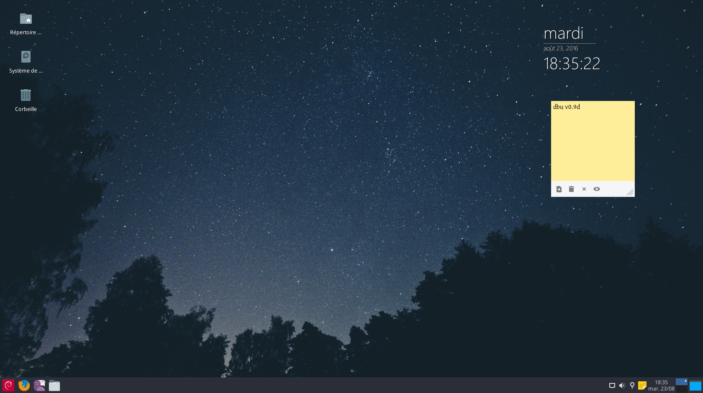

# dbu

Custom [Debian GNU/Linux](http://www.debian.org/) installer and live system.

[Debian GNU/Linux](https://en.wikipedia.org/wiki/Debian) is a major and widely used [Linux distribution](https://en.wikipedia.org/wiki/Linux_distribution). [GNU/Linux](https://en.wikipedia.org/wiki/Linux) is a [Free](https://en.wikipedia.org/wiki/Free_software) and open source [operating system](https://en.wikipedia.org/wiki/Operating_system).

**[Download ISO (64-bit)](https://github.com/nodiscc/dbu/releases)** (2.1G)

 * Run as a Live system from [USB](https://en.wikipedia.org/wiki/Live_USB)/[DVD](https://en.wikipedia.org/wiki/Live_CD) (runs from memory, no installation required), or install the OS to your machine (works offline).
 * Preinstalled software, preconfigured for desktop machines.
 * Based on Debian 8 Jessie (_stable_ Debian release).

### Required Hardware

    Computer with x86 or x86_64 processor
    Memory: min 512MB, recommended 1GB+
    Storage: 10+GB (system), 10+GB (user data).
    2GB+ USB drive or DVD-R for the installation media
    Optional: Internet access
    Optional: external backup storage

### Documentation

 * [Installation](doc/install.md)
 * [Usage](doc/usage.md)
 * [Installed software](doc/packages.md)
 * [Bugs/TODO](TODO.md)
 * [Customize/Build your own](doc/custom.md)
 * [Contributing](doc/contributing.md)

### License

[GNU GPLv3](LICENSE) unless stated otherwise in each individual file.  
Documentation under [CreativeCommons Attribution-ShareAlike](LICENSE).
