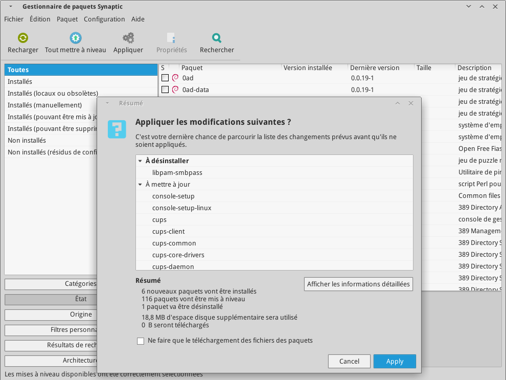
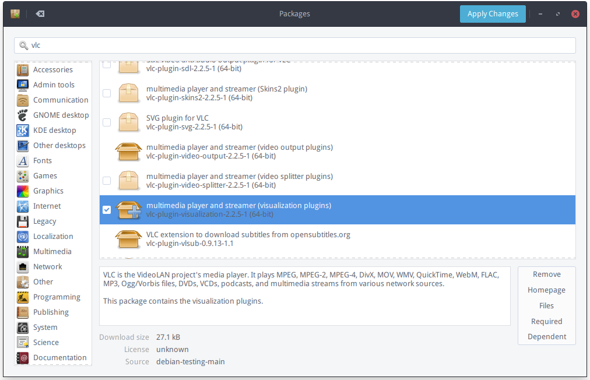
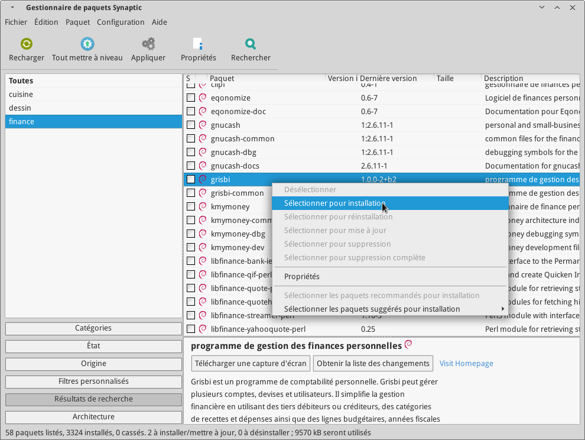
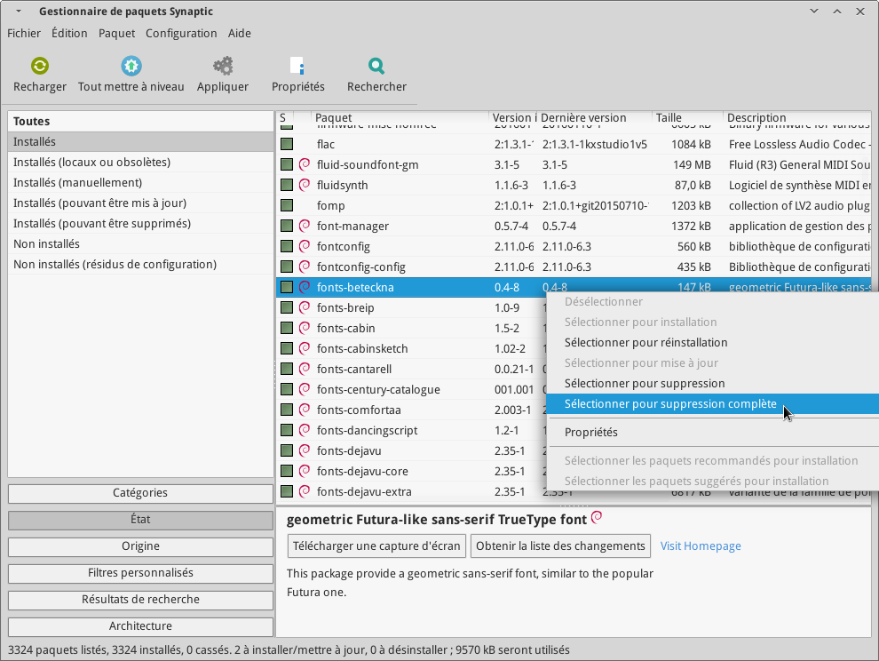

## Usage

 * Refer to each package's [online documentation](packages.md)
 * Use the `Help` menu inside programs.
 * [More documentation](#more-documentation)

_Note: The user account created during installation will have `sudo` administrator access (this account can perform administrator tasks, after password verification)_
 
-------------------------------------------

 * [Configuration](#configuration)
 * [Running programs and working with files](#running-programs-and-working-with-files)
 * [Installing/removing/updating software](#installingremovingupdating-software)
 * [Maintenance](#maintenance)
 * [Security](#security)
 
-------------------------------------------

#### Configuration

Use the `Settings manager` to configure your desktop or `Options`/`Preferences` inside applications menus.  
Other configuration files are generally found in `~/.config` or `/etc/` directories.

------------------------------------------

#### Running programs and working with files

Programs and files can be opened with

 * The _Application Menu_ (bottom left corner)
 * The _File Manager_
 * A _Terminal emulator_ (command line)
 * An _application launcher_ (by default `Ctrl+Space`)
 
Your _Home directory_ contains all personal files belonging to your user account on the computer.

------------------------------------------

#### Installing/removing/updating software

The _package management_ system allows you to install, remove or upgrade all 
component of your system (applications, system services, libraries, operating system...).

 * **[All Debian packages](https://packages.debian.org)** (+40 000 packages)

##### Upgrading all software

Run `Package Updater`, click `Install updates` and follow the instructions.

<!--- * From the [Synaptic](packages/synaptic.md) package manager:
   * click `Reload`, `Mark all upgrades`, `Apply`.
   * Review the proposed changes and `Apply`.

 -->

##### Installing/Removing software

Run the `Packages` utility, search for software by name or description, or browse the available categories.

<!-- * Use the `Search` button to search in package names or descriptions.
 * From the [Synaptic](packages/synaptic.md) package manager:
  * Right-click the package to install/remove
  * `Select for installation` or `Select for removal`.
  * Click `Apply` to proceed to installation.

  -->

For convenience other package managers are also available (`synaptic`, `aptitude`, `apt`...).
Most package managers have similar usage:

 * Search for software
 * Select software to install or remove
 * Apply changes

##### Setting up backups

Select the destination for backups in the 'General' tab (USB/external
drive/network location...), a schedule for automatic backups (eg. every week),
then go to the 'Include' tab and add files/directories (eg. Documents, Music...)
you want to keep backups of. Refer to the [Backintime](http://backintime.readthedocs.io/en/latest/) backup tool documentation for more info.

------------------------------------------

#### Maintenance

 * Run `Back In Time` to backup your data periodically to an external storage.
 * Apply available upgrades as soon as possible.
 * Keep your hardware clean/free of dust, ensure good air flow.

#### Basic security

 * Do not run untrusted software or commands.
 * Only install software from your package manager.
 * Keep installed software up-to-date.
 * Only enter your administrator password to perform necessary system administration tasks.
 * Do not copy-paste commands from the web to your terminal emulator.
 * Use strong (long) passwords/phrases.
 * Do not reuse your passwords for different services/machines (use a password manager).
 * Use encrypted communication protocols over insecure networks (SFTP, HTTPS, SSH, OTR, GPG...), use disk encryption to mitigate theft.
 * Minimize installed/running software.
 * Do not mark untrusted files as executable.

------------------------------------------

#### Keyboard shortcuts

Can be changed through `Settings > Keyboard` and `Settings > Window manager`

 * `Ctrl+Space` Open application launcher
 * `Win + N` Show/Hide notes
 * `Win + E` File manager
 * `Win + F` Find files
 * `Win + Q` Quit/Power off/restart/sleep
 * `Win + L` Lock the workstation
 * `Ctrl + Alt + Del` Task manager
 * `Win + T` Terminal emulator
 * `Win + R` Run a command
 * `Win + Esc` Applications menu
 * `Win + Pause` Settings manager
 * `Win + I` Web browser
 * `Win + C` Calculator
 * `Win + A` Alarm clock
 * `Win + M` Mail client
 * `Win + P` Instant messaging client
 * `Alt + Tab` Cycle between windows
 * `Win + D` Show Desktop
 * `Win + Left/Right/Up/Down` Go to left/right/up/down workspace
 * `Alt + F4` Close windows
 * `Alt + F7` Move windows
 * `Alt + F8` Resize windows
 * `Alt + mouse wheel` Zoom-in/out display

--------------------------------------------

## More Documentation

_Documentation, forums, communities, support channels..._

### Debian/General

 * **[Debian wiki](https://wiki.debian.org/fr/FrontPage)**
 * **[Arch Linux wiki](https://wiki.archlinux.org/)**
 * **[Wikipedia](https://en.wikipedia.org/wiki/Main_Page)**
 * **[Debian Forums](http://forums.debian.net)**
 * **[Debian IRC channels](https://wiki.debian.org/IRC)**
 * **[Debian Homepage](https://www.debian.org/)**
  * [Debian - Wikipedia](https://en.wikipedia.org/wiki/Debian)
  * [Debian Social Contract](https://www.debian.org/social_contract)
  * [Debian Constitution](https://www.debian.org/devel/constitution)
 * [Debian Documentation](https://www.debian.org/doc/)
 * [Debian Packages](https://www.debian.org/distrib/packages)
  * [Debian Screenshots] https://screenshots.debian.net/
 * [Forum Debian FR](https://www.debian-fr.org/) (fr)
  * [Debian FAQ - CCM](http://www.commentcamarche.net/faq/linux-97) (fr)
 * [Debian Hardware Compatibility List](http://kmuto.jp/debian/hcl/index.cgi)
  * [Linux Laptop Wiki](http://www.linlap.com/)
 * [Debian CD images](http://cdimage.debian.org/cdimage/)
  * [Unofficial CD images including firmware](http://cdimage.debian.org/cdimage/unofficial/non-free/cd-including-firmware/)
  * [Installing Debian step by step](https://debian-handbook.info/browse/stable/sect.installation-steps.html)
  * [Debian GNU/Linux Installation Guide](https://www.debian.org/releases/stable/amd64/index.html.en)
 * [Linux Journey](https://linuxjourney.com/)
 * [FOSSManuals](http://en.flossmanuals.net/)

### Software lists

 * [Open Source Linux Software - AlternativeTo.net](https://alternativeto.net/platform/linux/?license=opensource&sort=addeddate)
 * [Kickball/awesome-selfhosted: This is a list of Free Software network services and web applications which can be hosted locally. Selfhosting is the process of locally hosting and managing applications instead of renting from SaaS providers.](https://github.com/Kickball/awesome-selfhosted)
 * [n1trux/awesome-sysadmin: A curated list of amazingly awesome open source sysadmin resources.](https://github.com/n1trux/awesome-sysadmin)
 * [nodiscc/awesome-linuxaudio: A list of software and resources for professional audio/video/live events production on Linux.](https://github.com/nodiscc/awesome-linuxaudio)
 * [alebcay/awesome-shell: A curated list of awesome command-line frameworks, toolkits, guides and gizmos. Inspired by awesome-php.](https://github.com/alebcay/awesome-shell)
 * [Libre Projects](http://libreprojects.net/)
 * [All Projects - PRISM Break](https://prism-break.org/en/all/)
 * [List of applications - ArchWiki](https://wiki.archlinux.org/index.php/List_of_Applications)
 * [List of free and open-source software packages - Wikipedia, the free encyclopedia](https://en.wikipedia.org/wiki/List_of_free_and_open-source_software_packages)
 * [Framalibre - Annuaire du libre](https://framalibre.org/)
 * [Projects · Explore · GitLab](https://gitlab.com/explore)
 * [Explore - Projects - Github](https://github.com/explore)
 * [FossHub](http://www.fosshub.com/)
 * [DistroWatch.com: Put the fun back into computing. Use Linux, BSD.](http://distrowatch.com/)
 * [The LiveCD List](http://www.livecdlist.com/)

